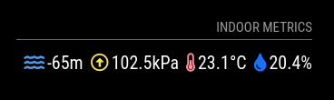

[](https://opensource.org/licenses/MIT) [](https://github.com/smartgic/MMM-IndoorTemperature/pulls) [](https://magicmirror.builders/) [](https://discord.com/invite/sHM3Duz5d3)

# MMM-IndoorTemperature

This module interacts with the [MagicMirror](https://magicmirror.builders/) to retrieve data from a [BME280](https://amzn.to/3B1Kv1O) sensor via the [Smart"Gic Abstract RPi API](https://github.com/smartgic/abstract-rpi).



## Installation

Clone this repository into `~/MagicMirror/modules` *(replace with your path)* directory.

```bash
cd ~/MagicMirror/modules
git clone https://github.com/smartgic/MMM-IndoorTemperature.git
```

Then update the MagicMirror configuration file `~/MagicMirror/config/config.js` *(replace with your path)*.

```js
{
    module: "MMM-IndoorTemperature",
    position: "top_left",
    header: "Indoor metrics",
    config: {
        abstractApiUrl: "https://192.168.1.66:8123",
        humiditySymbol: "fa fa-tint",
        temperatureSymbol: "fa fa-thermometer-half",
        pressureSymbol: "far fa-arrow-alt-circle-up",
        altitudeSymbol: "fas fa-water",
        interval: 60000,
        fadeSpeed: 4*1000,
        sensor: "bme280",
    }
}
```

## Configuration

| Option              | Default                     | Description                                                                     |
|---------------------|-----------------------------|---------------------------------------------------------------------------------|
| `abstractApiUrl`    | `None`                      | URL to the Smart'Gic Abstract RPi API                                           |
| `humiditySymbol`    | `fa fa-tint`                | Humidity Font Awesome icon                                                      |
| `temperatureSymbol` | `fa fa-thermometer-half`    | Temperature Font Awesome icon                                                   |
| `pressureSymbol`    | `far fa-arrow-alt-circle-up`| Pressure Font Awesome icon                                                      |
| `altitudeSymbol`    | `fas fa-water`              | Altitude Font Awesome icon                                                      |
| `interval`          | `60000`                     | Interval between data collection from the API                                   |
| `fadeSpeed`         | `4000`                      | How quickly the values fade in and out                                          |
| `sensor`            | `bme280`                    | Sensor name *(should be supported by the API)*                                  |
| `units`             | `config.units`              | Gets initialized with the constructor. Possible values: `metric`, `imperial`    |

## Credits

This module has been developped by [Smart"Gic](https://smartgic.io).
